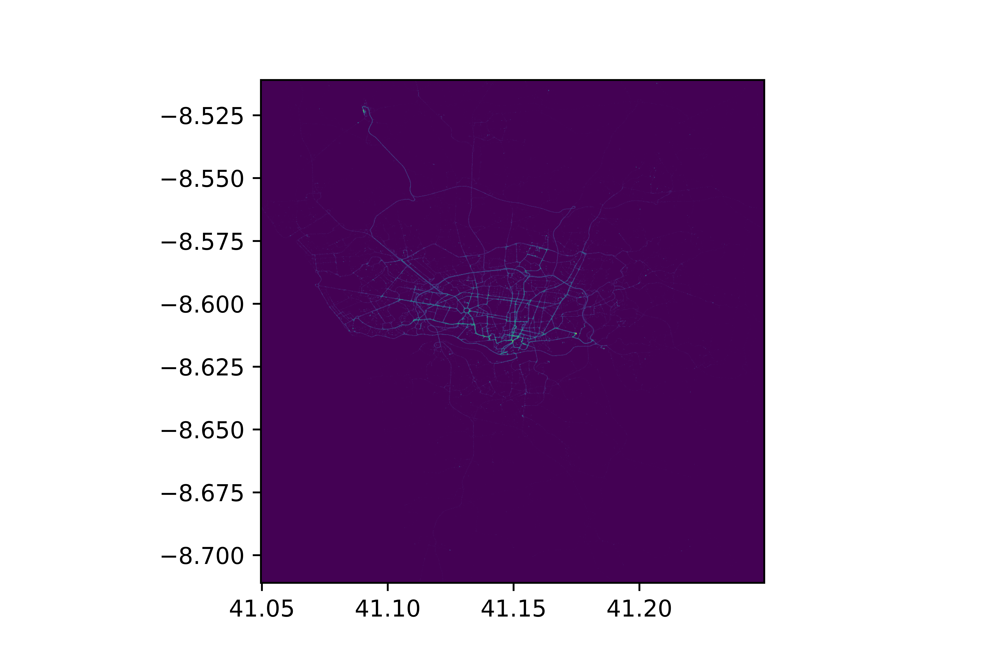
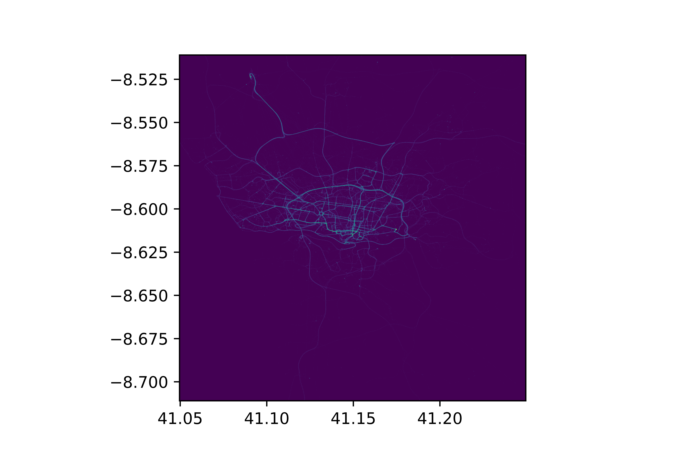
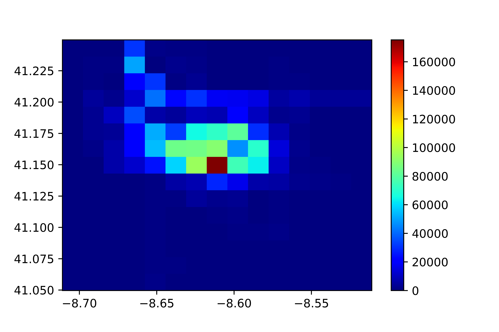

# Covid 19 Contact Tracing

People in close contact with someone who is infected with a virus, such as the Ebola virus, are at higher risk of becoming infected themselves, and of potentially further infecting others.

Closely watching these contacts after exposure to an infected person will help the contacts to get care and treatment, and will prevent further transmission of the virus.

## What does the project involve?

The project involves generating synthetic data for contact tracing using simple mathematic algebric formulae and then comparing performance between synthetic data and normal data while performing contact tracing on both types.

Taxi Trajectory data was used for the city of Porto, in Portugal and 5 random taxi drivers were assumed to be infected with COVID-19 virus. Then contact tracing was performed on the trajectory of the infected people throughout the city of Porto to identify the hotspots within the region.

## Results

### With Normal dataset
 

### with Synthetic dataset
 

## Resources

 - <a href="https://www.kaggle.com/c/pkdd-15-predict-taxi-service-trajectory-i/data">ECML/PKDD 15: Taxi Trajectory Prediction Dataset</a>

